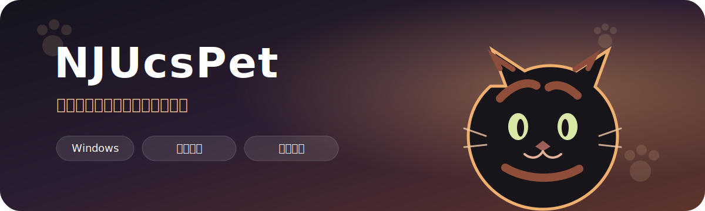
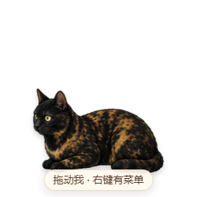
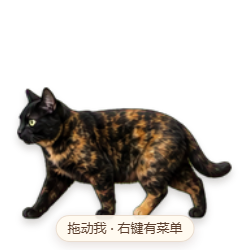
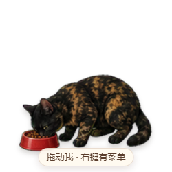
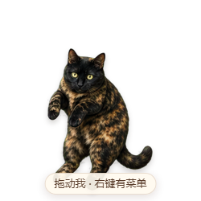

<p align="center">
  
</p>

<p align="center">
  <a href="https://github.com/NJULiuYvXi/NJUcsPet/releases/latest"></a>
  <a href="https://github.com/NJULiuYvXi/NJUcsPet/releases/latest"></a>
  
  <a href="./LICENSE"></a>
</p>

<p align="center">
  NJUcs御用宠物，一只会住在 Windows 窗口边缘的透明桌面伙伴。<br>
  她会在窗口顶部散步、吃饭、休息，也会跟着被拖动的窗口一起兜风。
</p>

<p align="center">
  <a href="https://github.com/NJULiuYvXi/NJUcsPet/releases/latest"><strong>下载最新安装包</strong></a>
  ·
  <a href="#使用方法">使用方法</a>
  ·
  <a href="#开发与构建">开发与构建</a>
</p>

## 动作预览

<table>
  <tr>
    <td align="center" width="25%">
      <br>
      <strong>安静待机</strong>
    </td>
    <td align="center" width="25%">
      <br>
      <strong>窗口散步</strong>
    </td>
    <td align="center" width="25%">
      <br>
      <strong>随机吃 2–4 口</strong>
    </td>
    <td align="center" width="25%">
      <br>
      <strong>轻轻提起</strong>
    </td>
  </tr>
</table>

> 以上图片由项目实际 Electron 窗口在最小内容尺寸 `250 × 250` 下直接截图，不是设计稿。

## 她能做什么

- **识别窗口顶部**：松开鼠标后垂直下落，停在下方最近的可见程序窗口顶部。
- **理解窗口遮挡**：上层窗口覆盖的区域会从落点和散步范围中扣除。
- **跟随程序窗口**：移动承载窗口时，桌宠保持相对位置并播放前风或后风兜风动画。
- **任务栏与屏幕底部活动**：没有可用窗口时，落到任务栏；任务栏隐藏时落到屏幕底部。
- **自然双向行走**：到达活动范围边缘后自动掉头，运动方向和角色朝向保持一致。
- **18 帧原生动画**：走路和提起动作均使用直接绘制的原生 18 帧循环。
- **安静驻留后台**：关闭桌宠会隐藏到系统托盘，可随时恢复或完全退出。
- **开机自启动**：安装后默认随 Windows 启动，也可在托盘菜单中关闭。

## 使用方法

| 操作 | 效果 |
| --- | --- |
| 按住左键拖动 | 提起桌宠并播放拖拽动画 |
| 松开左键 | 垂直下落到最近窗口、任务栏或屏幕底部 |
| 双击桌宠 | 随机吃 2–4 口 |
| 右键桌宠 | 打开吃饭、散步、休息、回到底部及后台菜单 |
| 双击托盘图标 | 从后台恢复桌宠 |
| 托盘右键 | 控制显示、自启动与完全退出 |

## 安装

1. 打开 [Releases](https://github.com/NJULiuYvXi/NJUcsPet/releases/latest)。
2. 下载 `NJUcsPet-Setup.exe`。
3. 运行安装程序并选择安装位置。
4. 如果 Windows SmartScreen 提示未知发布者，请核对下载来源和 Release 中的 SHA-256。

安装程序支持桌面快捷方式、开始菜单快捷方式、开机自启动和完整卸载。

## 工作方式

```text
鼠标拖拽
   │
   ▼
立即开始垂直下落 ──► 后台探测下方窗口
   │                         │
   │                         ▼
   ├─ 命中可见窗口顶部 ──► 绑定窗口并跟随移动
   │
   └─ 未命中窗口 ───────► 落到任务栏或屏幕底部
```

桌宠使用独立的原生窗口探测与跟踪辅助程序，避免 PowerShell 冷启动造成的延迟。运动逻辑采用单调下落约束：迟到或已经位于桌宠上方的探测结果不会让角色突然向上跳转。

## 开发与构建

需要 Node.js 和 Windows：

```powershell
git clone https://github.com/NJULiuYvXi/NJUcsPet.git
cd NJUcsPet
npm install
npm start
```

构建 Windows 安装程序：

```powershell
npm run dist
```

输出文件位于：

```text
dist/NJUcsPet-Setup.exe
```

## 项目结构

```text
NJUcsPet/
├─ main.js                 # Electron 主进程、拖拽、下落、窗口跟随与托盘
├─ renderer/               # 精灵动画、朝向与鼠标交互
├─ lib/                    # 行走、下落、遮挡范围和活动策略
├─ bin/                    # Windows 窗口探测与跟踪辅助程序
├─ assets/                 # 角色精灵表、兜风动画和应用图标
├─ tests/                  # 压力测试与 Electron 集成测试
└─ scripts/                # 素材标准化和原生辅助程序构建脚本
```

## 版本记录

### v1.0.4

- 将公开定位统一更新为“NJUcs御用宠物”，不再使用品种名称作为宣传描述。
- 同步更新仓库介绍、README 顶图、程序辅助说明与安装包元数据。
- 将桌宠提示文字由 11 px 放大到 13 px，并在最小窗口尺寸下重新完成截图验收。

### v1.0.3

- 首次公开发布 NJUcsPet。
- 发布与私有开发版 `NJUcsPete v1.0.3` 一致的最新源码和 Windows 安装程序。
- GitHub Release 标题和安装包文件名使用稳定名称，不附加版本号。
- 使用 12 FPS、1.5 秒周期的原生 18 帧走路动画。
- 走路放大至 130%，吃食、下落和着地放大至 120%，并固定脚底基线。
- 修复屏幕底部长距离散步被自动活动定时器提前打断、无法到达边缘掉头的问题。
- 保留窗口遮挡识别、窗口跟随、系统托盘及开机自启动功能。

## License

代码使用 [MIT License](./LICENSE) 发布。角色照片与生成动画素材仅用于本项目展示；如需在其他项目中复用角色素材，请先取得作者许可。
